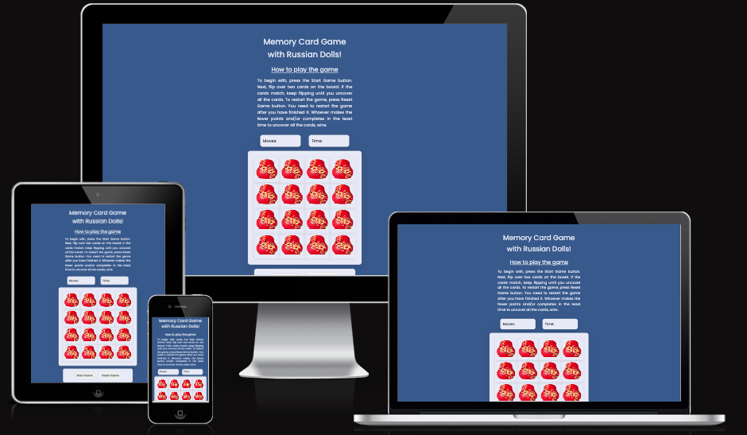
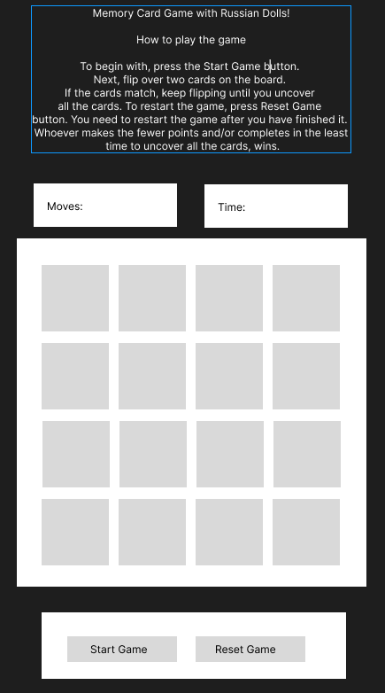
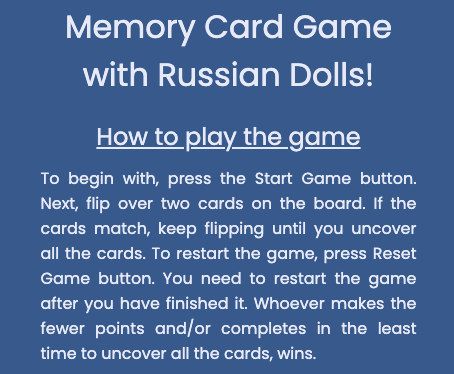
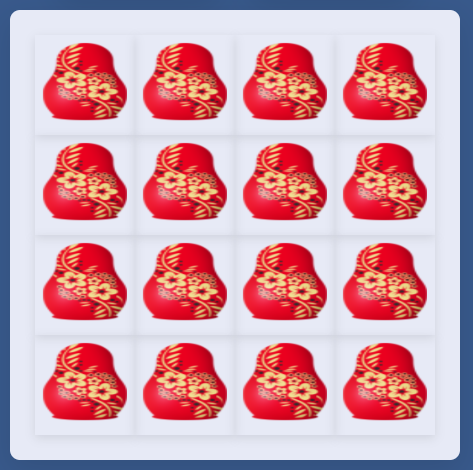
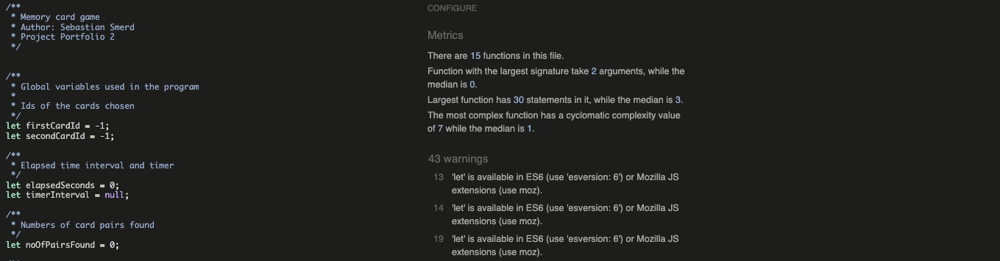
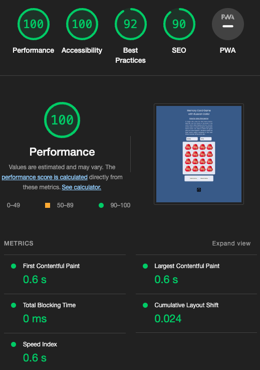

# Memory Card Game with Russian Dolls!
 
 
 

## Index - Table of Contents

- [Introduction](#introduction)
- [Design](#design)
    - [Wireframes](#wireframes)
- [Features](#features)
- [Future Features](#future-features)
- [UX](#ux)
    - [Site Goals](#site-goals)
    - [User Stories](#user-stories)
- [Testing](#testing)
    - [Validator Testing](#validator-testing)
    - [Manual Testing](#manual-testing)
    - [Fixed Bugs](#fixed-bugs)
    - [Unfixed Bugs](#unfixed-bugs)
- [Deployment](#deployment)
- [Cloning the GitHub repo](#cloning-the-github-repo)
- [Forking the GitHub repo](#forking-the-github-repo)
- [Working with CodeAnywhere](#working-with-codeanywhere)
- [Citation of Sources](#citation-of-sources)

 
 

# Introduction

Memory Cards with Russian Dolls is a memory card game where the user's aim is to find all matching picture cards in as little time and moves as possiple.

This game is an interactive Front-End web application using HTML, CSS and JavaScript. It was designed with simple, intuitive functionality in mind. All features are self-explanatory and the game itself is rather common, thus the rules are well known. There is a short description of the rules though. 

This game was tested through development, implementation and deployment stages. Also the documentation and comments were provided to maximise future maintainability. 

GitHub was used to manage source code during the develpment process.

The focus was also put on responsiveness front-end allowing users play both on small screens and desktops.

The application was deployed to the GitHub Pages cloud platform.

The README.md file explains the game purpose, the value, design, development and deployment procedure.

The game code with comments where required and formatted for maintability.
 
 

 
Link to [live site](https://ssmerd.github.io/memory-game/)

 
 

# Design

 
 

* ## Wireframes

The wireframe in Figma shows a minimal viable product. It shows the game rules, the board, counters and buttons.

 
 

 
 

# Features

The site contains all necessary features of a simple, functioning memory card game.

 
 

- **Heading**

    - Displays name of the game and the rules of the game
    - Located at the top of the site
 
 

 
 

- **Timer and Move Counter**

    - Above game area 
    - Timer starts as soon as user clicks Start Game button 
    - Timer stops when game is completed
    - Move counter increments by 1 every time the user clicks on a card
 
 

 
 

- **Game Area**
    - The main feature of the site
    - A grid of 16 cards (8 matching pairs), depicting Russian Dolls 
    - Cards appear face down at the start of the game
    - On click, cards are turned face up. Matching pairs remain face up. Non-matching cards get flipped back face down.
 
 

 
 

- **New Game and Reset Game Buttons**
    - Appears below the the grid
    - Start Game on click, starts the game and timer
    - Reset Game on click, resets the game, moves and timer.
 
 

 
 

- **Footer**
    - Located at the bottom of the site
    - Contains the link to the open-source GitHub repo of the site
 
 

 
 

# Future Features

Making the game multiuser with a ranking of points. 
Adding a leaderboard of the best players. 

 
 

# UX

 
 

## Site Goals

The goal of the site is to provide users the ability to play an enjoyable memory card game and compare results among them.

## User Stories

 
 

**As a site visitor I want to:**

- be able to play the game with simple click interaction
- see the time that has elapsed while playing the game
- see a move counter recording the amount of clicks I perform
- see my current score calculated after completing one round of the game
- be able to restart the game without reloading the page
- be able to find the site's creator on GitHub

 
 

# Testing
 
 

## Validator Testing
 
 
    

HTML and CSS validators were used to test the pages and css validity. No errors were returned for each page when passing through the official W3C validators.

 
 

* Home page html validation results

    - [Home Page](https://validator.w3.org/nu/?doc=https://ssmerd.github.io/memory-game/)
 
 

* CSS validation results

    - [Jigsaw validator](https://jigsaw.w3.org/css-validator/validator?uri=https://ssmerd.github.io/memory-game/)
 
 

* JavaScript [JSHint](https://jshint.com/)

 
 

* Performance, Accessibility, SEO, Best Practices 

 
 

The accessibility of each of the main pages was checked using the lighthouse tool in devtools with a score within the 90 - 100% bracket for all metrics.

 
 

* Multiple browser testing

I tested the game on Google Chrome and Mac Safari on computer and iPhone. The buttons on IPhone Safari had different colors then programmed.

 
 

## Manual Testing

| Test              | Outcome |
|-------------------|---------------|
|be able to play the game with simple click interaction|pass|
|see the time that has elapsed while playing the game|pass|
|see a move counter recording the amount of clicks I perform|pass|
|see my current score calculated after completing one round of the game|pass|
|be able to restart the game without reloading the page|pass|
|be able to find the site's creator on GitHub|pass|

All user stories were tested and no faults were found. I thoroughly tested the game and its responsiveness with Google Inspect functionality and ui.dev/amiresponsive tool. Initially I had issues with the asynchronous nature of JavaScript events but I managed to find solutions.

 
 

## Fixed bugs

Only a number of html and css issues have been found initially by the validators. I rectified them.

Sample:  I put the class attribute twice on one div. I used flex-direction: rows instead of row.

 
 

## Unfixed bugs

No unfixed bugs to date.

 
 

# Deployment

 
 

This site was deployed to GitHub pages [Live Site](https://ssmerd.github.io/memory-game/).  The steps to deploy are as follows:

*   In the GitHub repository, navigate to the Settings tab
*   On the left hand side choose Pages tab
*   From the source section drop-down menu, select the Main Branch
*   Once the Main Branch has been selected, the page will be automatically refreshed with the detail ribbon display to indicate the successful deployment

 
 

# Cloning the GitHub repo

 
 

This repo can be cloned as follows:

*   On the main repo page [Repo page](https://github.com/ssmerd/memory-game) navigate to the Code tab
*   Select the way you want to clone using HTTPs, SSH or GitHub CLI and click the copy button
*   Open Git Bash ot Terminal
*   In your terminal, in a chosen directory paste the command:
    *      https://github.com/ssmerd/memory-game.git
*   Press Enter to create your local clone

 
 

# Forking the GitHub repo

 
 

In order to create a copy of the original repository on our GitHub account to view or edit it without affecting the original owner's repository we can fork it.

*   At the top of the Repository [Repo page](https://github.com/ssmerd/memory-game), above the Settings button, locate the Fork button 
*   Once clicked, it will create as a copy of the original repository in your own GitHub account

 
 

# Working with CodeAnywhere

 
 

I used CodeAnywhere to work on the project. 

*   Working with Code Anywhere was initially a challenge. It timed out many times and couldn't load properly. I lost many hours of work.
*   After the fix was identified all was well. 

 
 

# Citation of Sources

 
 

* ### Inspiration

The project was inspired by Ania Kubow's sample Java Script games on youtube.

https://youtu.be/ec8vSKJuZTk

* ### HTML and CSS 

https://www.w3schools.com/

https://developer.mozilla.org/

https://stackoverflow.com/

* ### Wireframes

https://figma.com

* ### Responsivness testing

https://ui.dev/amiresponsive

Chrome Inspect

* ### HTML and CSS validations

https://validator.w3.org/
https://jigsaw.w3.org/css-validator/
https://jshint.com/

* ### Fonts and icons

Google Fonts and Icons

https://fonts.google.com/

* ### Media

https://imgbin.com

 
 

### <a name="acknowledge">Acknowledgements</a>

 
 

* Mentor - Chris Quinn
* Cohort Facilitator - Special credit to Alan Bushell who gave great support and tips when testing the website.

 
 

<a href="#top">BACK TO TOP 🔼</a>